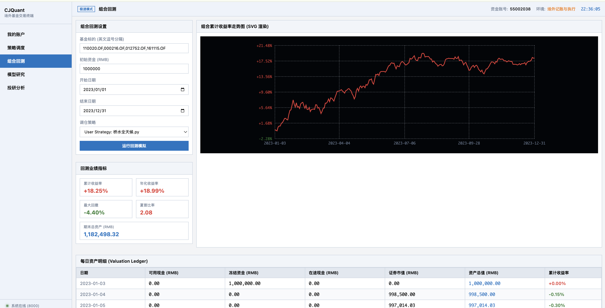
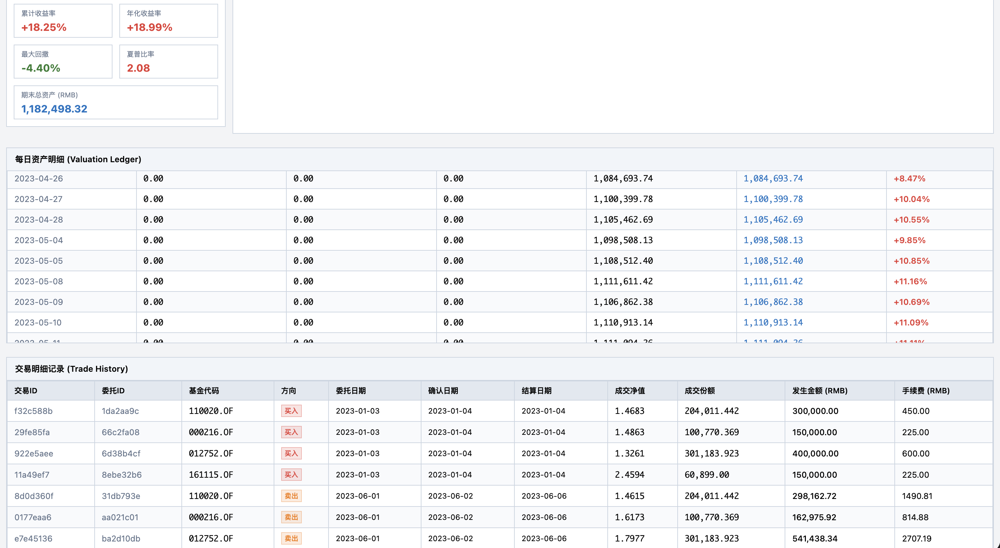
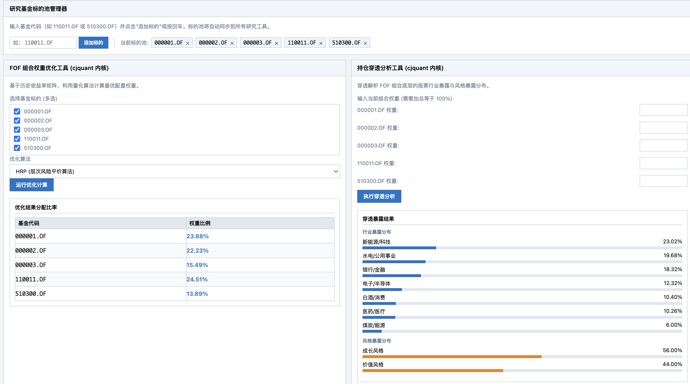
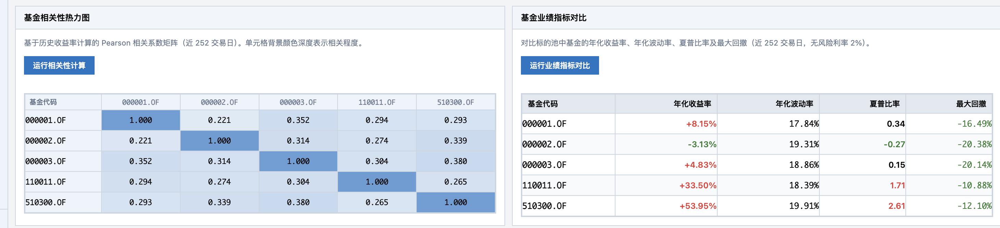
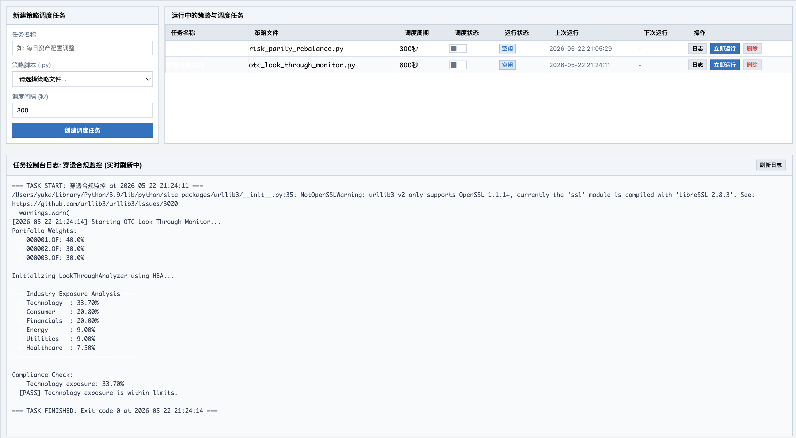

# cjquant

*The Quantitative Framework for China OTC Funds & Asset Allocation*

cjquant 是一个专为国内资管机构（公募FOF、理财子、券商资管、FO等）设计的场外基金量化与资产配置投研框架。针对国内二级市场外产品（公募基金、私募基金、银行理财）数据非标、流动性受限、费率结构复杂等核心痛点，提供从数据清洗、归因分析到复杂流动性回测与组合优化的全链路解决方案。

## 摘要

目前主流的量化框架（如 vn.py, qlib, backtrader）均针对场内高频及日频交易设计，在面对场外资产时存在逻辑不兼容的问题。cjquant 放弃了传统的“订单-撮合”模型，采用“份额-净值-流动性时间轴”模型重构了回测引擎，并内置了针对非标低频数据的量化评价体系，旨在为人民币资产配置提供工业级的基础设施。

---

## 安装

安装方式：

```bash
pip install cjquant
```

安装之后，您可以直接进行开发，或者启动投研终端：

```bash
git clone http://github.com/imbue-bit/cjquant/
cd cjquant
python run_gui.py
```




---

## 功能特性

### 1. 场外资产真实撮合引擎
针对国内公私募产品复杂的申赎规则，完全重构了流动性与费率模拟机制：
*   非对称流动性时间轴：原生支持跨交易日的 T+n 确认与到账机制（例如：申购 T+1 确认并计息，赎回 T+2 确认 T+4 资金可用），精确还原资金占用成本。
*   非线性阶梯费率模型：支持根据持有自然日/交易日动态计算赎回费（如：持有<7天收取1.5%惩罚性赎回费，>365天免赎回费）。
*   多源收益分配与业绩报酬：支持公募基金的现金分红与红利再投（配息机制），以及私募基金复杂的高水位法（High-Water Mark）与门槛收益率（Hurdle Rate）业绩报酬提取扣减。
*   份额合并与映射：自动处理同一基金 A/C/E 类份额的申购费/销售服务费差异，在回测及归因中实现底层资产的合并穿透。

### 2. 异构数据对齐与治理 
解决国内大资管跨机构数据源的异构问题：
*   序列对齐：针对公募日频、私募周/月频、宏观指标季频的异构数据，提供前向填充（ffill）、三次样条插值（Cubic Spline）、以及基于自回归与同类指数映射的 Beta 填充算法。
*   去除幸存者偏差：支持底层存续期生命周期管理。引入退市/清盘基金的强制赎回机制与惩罚项，避免截面选取时的前视偏差。
*   基金经理职业生涯拼接：底层数据结构支持“人”与“产品”的解耦。支持将某基金经理在不同产品、不同机构的任职区间收益率进行拼接，并根据管理规模（AUM）进行加权平滑。

### 3. 穿透分析
针对场外基金“黑盒化”特性，提供多层次的因子解析：
*   基于净值的风格分析 (RBSA - Returns-Based Style Analysis)：内置带约束的非负最小二乘法（NNLS）与滚动多元回归。支持自定义因子库（如 Fama-French 3/5 因子，或申万一级行业指数），实时测算基金动态仓位与风格漂移水平。
*   基于持仓的归因测算 (HBSA - Holdings-Based Style Analysis)：解析公募季报/半年报底层真实持仓。支持经典的 Brinson-Fachler 归因模型（资产配置/个股选择/交互效应分离）。




### 4. 机资产配置优化
专为中低频调仓设计的组合优化算法库：
*   协方差矩阵收缩：针对场外低频数据样本不足导致的协方差矩阵失真，内置 Ledoit-Wolf 收缩算法。
*   机器学习与层次组合：除传统均值方差（M-V）外，提供基于图论与无监督聚类的层次风险平价算法及最大分散度组合（MDP）。
*   主观观点融合：集成 Black-Litterman 模型，支持投资经理将对特定宏观事件或行业板块的主观预测转化为后验权重。

---

以下示例代码展示了如何调用框架内各子模块完成复杂的资管投研任务。

### 考虑国内场外真实流动性与费率的 FOF 回测

传统量化框架默认买入即成交，而在实际 FOF 管理中，流动性占用与申赎损耗对组合收益影响巨大。使用 `cjquant.backtest` 可以精确还原这一过程。

```python
import pandas as pd
from cjquant.data.pipeline import DataPipeline
from cjquant.backtest.engine import OTCBacktestEngine
from cjquant.backtest.fee import OTCFeeModel
from cjquant.backtest.slippage import SquareRootSlippage

# 1. 准备市场数据
pipeline = DataPipeline()
fund_1 = pipeline.get_public_fund("000001.OF", start_date="2023-01-01", end_date="2023-12-31")
fund_2 = pipeline.get_public_fund("000002.OF", start_date="2023-01-01", end_date="2023-12-31")
market_data = pd.concat([fund_1, fund_2])

# 2. 设置费率与冲击成本模型
fee_model = OTCFeeModel(buy_fee_rate=0.0015)
fee_model.set_sell_tiers([
    (7, 0.015),          # 持有 <7 天，赎回费 1.5%
    (30, 0.0075),        # 持有 <30 天，赎回费 0.75%
    (365, 0.005),        # 持有 <1 年，赎回费 0.5%
    (float('inf'), 0.0)  # 大于 1 年免赎回费
])

slippage_model = SquareRootSlippage(impact_lambda=0.05, fund_aum=1e8)

# 3. 初始化回测引擎，设定 T+1 确认，T+3 到账
engine = OTCBacktestEngine(
    market_data=market_data,
    initial_cash=10000000.0,
    t_plus_confirm=1,
    t_plus_settle=3,
    slippage_model=slippage_model
)
engine.fee_model = fee_model

# 4. 模拟策略回测循环
while engine.current_date_idx < len(engine.trading_dates):
    current_date = engine.current_date
    
    # 示例策略：在第 10 个交易日买入，在第 100 个交易日卖出
    if engine.current_date_idx == 10:
        engine.submit_order('000001.OF', 'BUY', value=5000000)
        engine.submit_order('000002.OF', 'BUY', value=4000000)
    elif engine.current_date_idx == 100:
        shares_1 = engine.positions['000001.OF'].total_available_shares
        shares_2 = engine.positions['000002.OF'].total_available_shares
        engine.submit_order('000001.OF', 'SELL', shares=shares_1)
        engine.submit_order('000002.OF', 'SELL', shares=shares_2)
        
    engine.step()

# 5. 导出回测结果
engine.export_trades_csv('trades.csv')
engine.export_results_csv('results.csv')
```

### 基金持仓与风格穿透

针对国内私募基金不披露底仓的黑盒特性，调用 `cjquant.look_through` 模块，通过滚动净值序列反推真实的因子暴露度（RBSA）。

```python
import pandas as pd
from cjquant.data.pipeline import DataPipeline
from cjquant.look_through.engine import LookThroughAnalyzer

# 1. 准备基金收益率与因子收益率数据
pipeline = DataPipeline()
fund_df = pipeline.get_public_fund("000001.OF", start_date="2023-01-01", end_date="2023-12-31")
factor_df = pipeline.get_public_fund("000300.OF", start_date="2023-01-01", end_date="2023-12-31")

fund_returns = fund_df['adj_nav'].pct_change().dropna()
factor_returns = pd.DataFrame({'HS300': factor_df['adj_nav'].pct_change()}).dropna()

# 2. 初始化穿透分析器 (RBSA 模式)
analyzer = LookThroughAnalyzer(method='RBSA', factor_returns=factor_returns)

# 3. 进行风格分析（滚动窗口设为 60 天）
result = analyzer.run(fund_returns, window=60)

print(f"基金代码: {result.fund_code}")
print(f"分析日期: {result.analysis_date}")
print(f"R-Squared (解释度): {result.r_squared:.4f}")
print("因子暴露权重:", result.exposures)
```

### 基于机器学习的前沿组合优化与可视化报告

使用 `cjquant.optimizer.machine_learning` 处理传统均值方差模型在非标数据中协方差矩阵极易失效的问题，并通过 `cjquant.visualizer` 生成可视化分析报告。

```python
import pandas as pd
from cjquant.data.pipeline import DataPipeline
from cjquant.optimizer.machine_learning import HRPOptimizer
from cjquant.visualizer.reporter import CJQuantReporter

# 1. 对齐多只基金的收益率序列
pipeline = DataPipeline()
# create_universe_panel 自动调用 DataAligner 进行对齐治理
aligned_nav = pipeline.create_universe_panel(
    public_codes=["000001.OF", "000002.OF"],
    start_date="2023-01-01",
    freq="B",
    resample_method="ffill"
)
aligned_returns = aligned_nav.pct_change().dropna()

# 2. 使用层次风险平价算法 (HRP) 分配权重
optimizer = HRPOptimizer(aligned_returns)
optimal_weights = optimizer.optimize()
print("HRP 优化权重:\n", optimal_weights)

# 3. 生成可视化 HTML 报告
reporter = CJQuantReporter(stats_csv_path='results.csv', trades_csv_path='trades.csv')
reporter.generate_html('report.html')
```

### 导出 O32 格式下单列表进行指令对接

调用 `cjquant.execution` 模块，可直接将回测产生的交易记录或待交易订单，导出为符合国内金融机构恒生 O32 投资系统导入格式要求的 CSV/Excel 指令单。

```python
from cjquant.execution import O32OrderExporter

# 1. 初始化 O32 导出器，配置产品组合编号与资产单元
exporter = O32OrderExporter(
    portfolio_id="FOF001",
    asset_unit="FOF001_01",
    strip_suffix=True  # 自动去除代码中的市场后缀 (例如将 000001.OF 转为 000001)
)

# 2. 传入回测引擎中的未执行订单队列进行导出 (或使用 engine.trade_history 导出成交确认单)
# 支持导出为中文 Windows 环境下 O32 默认接收的 GBK 编码 CSV
exporter.export(engine.pending_orders, "o32_orders.csv", format="csv", encoding="gbk")
```

### 下单 API

提供针对场外基金（申购、赎回）的极简下单 API，底层支持多种导出通道（如恒生 O32 格式、微信理财通格式等），默认保存到运行目录：

```python
from cjquant.execution import OTCExecutor

# 1. 初始化场外下单执行器，默认输出目录为当前路径
executor = OTCExecutor(
    portfolio_id="FOF002",
    asset_unit="FOF002_01",
    output_dir="./"
)

# 2. 提交申购金额或赎回份额 (只暴露 buy/sell API)
executor.buy("000001.OF", amount=100000.0)  # 申购 10 万元
executor.sell("000002.OF", shares=50000.0)   # 赎回 5 万份

# 3. 执行下单，同时导出为 O32 与微信理财通格式，输出到运行目录
# 导出的文件为 ./otc_orders_o32.csv 和 ./otc_orders_wechat.csv
executor.execute(channels=["o32", "wechat"], file_prefix="otc_orders")
```



---

## 数据生态与系统集成

考虑到资管机构底层数据来源的复杂性，cjquant 核心库解耦了数据获取逻辑，提供标准化的 `Adapter` 接口。用户可根据自身环境快速接入私有或第三方数据源：

*   本地/私有数据库：支持接入 MySQL, PostgreSQL, ClickHouse 中存储的估值表。
*   金融终端接口：付费版维护针对 Wind (WdQx), 聚源 (JYDB), 东方财富 Choice 的对接层。
*   开源测试数据：内置测试适配器，便于冷启动与策略初步验证。

通过修改配置文件，即可无缝切换底层数据源，上层策略代码无需做任何修改。


---

## Roadmap

我们致力于将 cjquant 打造成国内买方机构的场外投研标准件，未来演进重点包括：

- 完善衍生品与另类资产抽象层，支持包含雪球结构产品、CTA 私募的跨资产类别宏观配置测试。
- 支持基于因子表现和组合持仓的 Brinson 归因报告自动化生成。
- 开放合规风控引擎，提供事前交易拦截与机构白名单管理支持。

## 协议与授权

本项目的开源版本遵循 GPLv3  协议发布。对于资管机构的私有化定制、高级算子支持及系统级集成，请参考商业授权方案。
